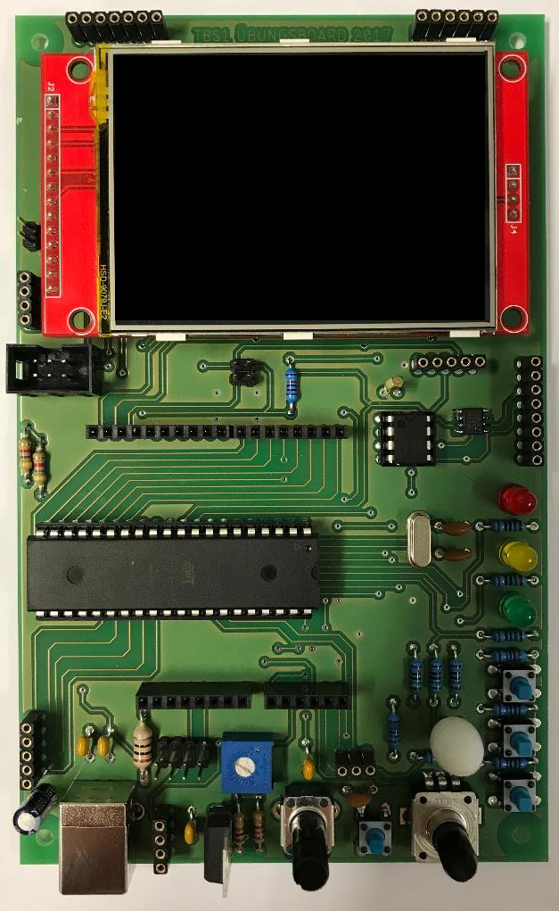

# TBS1-Board

Das "TBS1-Board" ist ein Übungsboard zur Programmierung von Mikrocontrollern. Es wurde 2017 im Rahmen eines Projektes der Fachschule für Technik an der Technischen Beruflichen Schule 1 in Bochum (TBS1) entwickelt. Das Übungsboard kommt bei der Technikerausbildung zum Einsatz.

## TBS1-Board 2017

- [Projektdokumentation (Auszug)](Projektdokumentation_2017_Auszug.pdf)
- [Schaltung und Platinenlayout](Schaltung und Platinenlayout)

## Weiterentwicklung

Infos folgen ...

